# 05 · Redline（修订标记稿）生成指南

> **为什么要重做**：仓库里的两份标记稿 —— 根目录 `is26_marked.tex`（手工标记，
> 59 页）与 `SurveyOfFTSG-main_clean/is26_redline.tex`（上一轮 latexdiff 产物）——
> 都**无法机械继承**本轮改动。本轮必须从 git 历史重新生成。
>
> 自动化脚本：`scripts/redline.sh`

---

## 1. 三种修订标记体系（必须先分清）

仓库里同时存在**三套互不兼容**的标记机制：

| # | 位置 | 机制 | 数量 | 能否机械继承 |
|---|---|---|---:|---|
| 1 | `SurveyOfFTSG/sections/` | 自定义宏 `\revadd`/`\revdel` 家族 | **802** 处 | ❌ 无法 |
| 2 | `SurveyOfFTSG/SurveyOfFTSG-main_clean/sections/` | 无标记（干净快照） | 0 | — |
| 3 | `is26_redline.tex` | latexdiff 的 `\DIFadd`/`\DIFdel` | 1,312 处 | ❌ 冻结的 |

### 为什么不能机械继承

**体系 1 的自定义宏定义在根目录 `is26.tex` 里**（`\providecommand` 共 8 个）：

```latex
\providecommand{\revadddec}[1]{#1}
\providecommand{\revdeldec}[1]{}
\providecommand{\revaddblock}[1]{#1}
\providecommand{\revdelblock}[1]{}
\providecommand{\revnote}[1]{}
\providecommand{\markadd}[1]{#1}
\providecommand{\markdel}[1]{}
\providecommand{\citebox}[1]{#1}
```

工作区 `is26.tex` **没有**这 15 行 —— 这就是两个 `is26.tex` 的**唯一差异**
（3,838 B vs 2,982 B）。

**结论**：
- 本轮采用**方案 A（干净覆盖）** —— 把工作区的干净 `sections/`（无标记）覆盖两处。
- 代价：根目录 `is26_marked.pdf`（59 页手工标记稿）**会失去标记**。
- 补偿：用 `latexdiff` 从 git 历史重新生成一份**更可靠**的标记稿。

> ⚠️ **必须在提交前确认这个取舍可以接受。**
> 如果期刊/导师**要求**保留旧的手工标记稿，见本文 §7「替代方案」。

---

## 2. 安装 latexdiff

### ❌ 不要用 tlmgr

TeX Live 2025basic 装在 `/usr/local/texlive/2025basic`，**归 root 所有**：

```
$ tlmgr install latexdiff
You don't have permission to change the installation in any way,
specifically, the directory /usr/local/texlive/2025basic/tlpkg/ is not writable.
```

### ✅ 用 Homebrew

```bash
export PATH="/opt/homebrew/bin:$PATH"
brew install latexdiff
```

Homebrew 信息：
```
latexdiff: stable 1.4.0 (bottled)
https://www.ctan.org/pkg/latexdiff
License: GPL-3.0-or-later
```

安装后：
```bash
command -v latexdiff          # /opt/homebrew/bin/latexdiff
latexdiff --version
```

> ⚠️ `latexdiff` 脚本内部会调用 `latex`/`pdflatex`，因此
> `PATH` 需要**同时**包含 `/Library/TeX/texbin` 和 `/opt/homebrew/bin`。

---

## 3. 基准提交的选择

```
e7fa6b0  09-13 20:50  fix(Figure 2): 根节点标题溢出框架，改为两行显示   ← origin/main
aa33670  09-13 20:37  修改了标题结构，并且更新了reference到最新；      ← 旧 HEAD
1df0309  09-13 20:34  docs(清单): 新增本轮修改内容清单，归档第三轮全部改动
d90bd4d  09-13 20:23  fix(回信数字): 语料 130→131，参考文献数改为实际 222
b1c088d  09-13 19:13  fix(标记稿): 块级删除补上红色删除线
906bcac  09-13 14:48  fix(标记稿): 移除 33 个空白标记
a364c9f  09-13 11:42  feat(引用审计): 移植 clean 版全部增量内容
```

| 基准 | 含义 | 适用 |
|---|---|---|
| `aa33670` | 上一轮「正式稿」状态 | **默认推荐** —— 审稿人手里的版本 |
| `e7fa6b0` | 含 Figure 2 根节点修复 | 若你已把 `e7fa6b0` 发给审稿人 |
| `a364c9f` | 引用审计完成点 | 只看本轮引用改动 |

```bash
./redline.sh              # 用默认 aa33670
./redline.sh e7fa6b0      # 指定基准
./redline.sh --no-build   # 只生成 .tex
```

---

## 4. 脚本做了什么

```mermaid
flowchart TD
    A["git show BASE:SurveyOfFTSG-main_clean/&#42;"] --> B["/tmp/redline_XXX/old/"]
    C["当前 main_clean/ 镜像"] --> D["/tmp/redline_XXX/new/"]
    B --> E["内联展开 \\input{}&lt;br/&gt;→ old/flat.tex"]
    D --> F["内联展开 \\input{}&lt;br/&gt;→ new/flat.tex"]
    E --> G["latexdiff --type=UNDERLINE"]
    F --> G
    G --> H["后处理：修补表格/公式内的 DIF 宏"]
    H --> I["main_clean/is26_redline.tex"]
    I --> J["pdflatex → bibtex → pdflatex ×2"]
    J --> K["is26_redline.pdf"]
```



### 关键设计

**a) 为什么先内联展开**

仓库的 `is26.tex` 通过 `\input{sections/xx.tex}` 组装。
latexdiff 对 `\input` 的处理不可靠（尤其是 `\input` 顺序非数字时）。
内联成单文件后，diff 粒度精确到字符。

**b) 为什么用 `--type=UNDERLINE`**

| type | 效果 | 适用 |
|---|---|---|
| `UNDERLINE` | 新增下划线，删除加删除线 | **期刊修订稿** ✅ |
| `TRADITIONAL` | 新增 `\DIFadd`（蓝字），删除 `\DIFdel`（红字） | 内部审阅 |
| `CFONT` | 变化处用不同字体 | 纯文本环境 |

**c) 根目录 `is26.tex` 的 `\input{}` 顺序是非数字的**

```
00_abstract → 01_introduction
\section{Results}
  03 → 04 → 05 → 06 → 07 → 08 → 09_data_resources
10_challenges      ← Discussion
02_methodology     ← Methods，排在 Discussion 之后！
12_declarations
\bibliography{ultimate_complete}
13_figures → 14_tables
```

> `11_conclusion.tex` **没有被** `is26.tex` 加载（只有废弃的
> `is26_cas_backup.tex:124` 引用它）。这是正常的，不要"修复"。
> 内联展开会忠实保留这个顺序，因此 `.log` 的行号**不能**按文件数字顺序映射。

---

## 5. 期望产物

| 文件 | 说明 |
|---|---|
| `SurveyOfFTSG-main_clean/is26_redline.tex` | latexdiff 源 |
| `SurveyOfFTSG-main_clean/is26_redline.pdf` | 标记稿 PDF |
| `SurveyOfFTSG-main_clean/is26_redline.bbl` | 参考文献 |

### 数值期望（✅ 已用 2026-09-13 实跑值校准）

| 指标 | 期望值 | 本轮实测 | 说明 |
|---|---:|---:|---|
| `is26_redline.tex` | > 100 KB | **159,749 B / 1,215 行** | 低于 50 KB 说明踩了坑 4b |
| LaTeX errors | 0 | **0** | |
| bibitem | 199 | **199** | 与正式稿一致 |
| pages | 54–60 | **55** | 正式稿 54 页 + 标记膨胀 |
| `DIFadd` 次数 | > 100 | **237** | 为 0 说明没检测到变化 |
| `DIFdel` 次数 | > 100 | **263** | |
| `\DIFaddbegin` / `\DIFdelbegin` | — | **80 / 80** | 应相等 |
| Overfull hbox | < 50 | **10** | ⚠️ latexdiff 固有，非缺陷 |

> **⚠️ 首要健康指标是文件大小**：`is26_redline.tex` 若只有几 KB
> （典型值 5,051 B / 89 行），说明**只生成了 preamble**，正文整段丢失 ——
> 见坑 4b。这个失败模式不报错，必须靠体积判断。

> **关于 Overfull**：latexdiff 会在行内插入带回车的标记文本
> （如 `\mbox{%DIFAUXCMD\n\citep{xxx} }\hskip0pt%DIFAUXCMD\n`），
> 打乱断行。**不要试图消除它们** —— 那是徒劳的，且会破坏标记结构。
> 本轮实测仅 10 个，远低于此前的 38 个。

### 彩色文字量核验（确认标记真的渲染出来了）

```python
import pymupdf
d = pymupdf.open('is26_redline.pdf')
blue = red = 0
for p in d:
    for b in p.get_text('dict')['blocks']:
        for l in b.get('lines', []):
            for s in l['spans']:
                if not s['text'].strip(): continue
                c = s['color']
                if (c >> 16 & 0xFF) < 80 and (c & 0xFF) > 180: blue += len(s['text'])
                elif (c >> 16 & 0xFF) > 180 and (c & 0xFF) < 80: red += len(s['text'])
print("蓝色新增 %d 字符 ; 红色删除 %d 字符" % (blue, red))
# 本轮实测：蓝色 6,703 ; 红色 2,253
```

两项若都是 0，说明 `--type=UNDERLINE` 之外的颜色宏没生效。

---

## 6. 已知坑与规避

### 坑 1：`\mbox{%DIFAUXCMD` 里含换行，编辑工具会失败

latexdiff 生成的引用包装长这样：

```latex
\mbox{%DIFAUXCMD
\citep{key} }\hskip0pt%DIFAUXCMD
```

**中间有真实换行符。** 用 `replace_string_in_file` 类工具匹配时，
换行归一化会导致**静默失败**。

✅ 规避：用 Python 以 `assert s.count(old)==1` 精确替换：

```python
import io
p = 'is26_redline.tex'
s = open(p, encoding='utf-8').read()
old = "\\mbox{%DIFAUXCMD\n\\citep{key} }\\hskip0pt%DIFAUXCMD\n"
assert s.count(old) == 1, "found %d" % s.count(old)
open(p,'w',encoding='utf-8').write(s.replace(old, new))
```

> ⚠️ **务必保留 `\hskip0pt` 前的「空格 + `}`」** —— 少了空格会改变断行点。

### 坑 2：表格/公式环境内的 DIF 宏会崩

`tabular` / `equation` / `align` 环境里出现 `\DIFadd`（或 `\DIFdel`）时，
LaTeX 常报 `Misplaced \noalign` 或 `Missing } inserted`。

`redline.sh` 的**后处理**步骤会自动把这几类环境内的
`\DIFadd{X}` → `X`、`\DIFdel{X}` → 丢弃。

### 坑 3：`natbib` + `hyperref` 的 `\cite` 双花括号

latexdiff 有时生成 `\cite{{key}}`。搜索并修复：

```bash
grep -n '\\\\cite{{' is26_redline.tex | head
```

### 坑 4b：⛔ **绝对不要加 `--show-preamble`**（本轮实测踩坑）

这是最隐蔽的一个坑 —— latexdiff **不会报错**，只是静默地丢掉整个正文：

```
# 实验对照（同一对输入文件）
latexdiff --type=UNDERLINE --show-preamble ...   →  89 行 /    5,051 B   ← 只有 preamble
latexdiff --type=UNDERLINE                ...    → 1215 行 / 159,749 B   ← 正确
```

- 症状：`is26_redline.tex` 只有 89 行，全是 `%DIF PREAMBLE` 注释，
  **没有 `\documentclass`、没有 `\begin{document}`**；编译报 2 个 error、0 个 bibitem。
- 原因：该选项的语义是「只输出 preamble」（供外部拼装用），不是「输出 preamble + 正文」。
- 处置：**删掉该 flag**。脚本第 4 步「后处理」本就打算改用镜像自己的 preamble，
  因此这里根本不需要单独取 preamble。

### 坑 4c：`--add-to-config` 必须写 `varenv=pattern`

裸写该 flag 会把**下一个参数**（即文件名 `"$OLD/flat.tex"`）当作赋值目标吞掉：

```
Illegal assignment \documentclass[11pt,a4paper]{article} in configuration list
(must be variable=value)
```

正确写法：
```bash
--add-to-config "PICTUREENV=(?:picture|DIFnomarkup|forest|tikzpicture)[\\w\\d*@]+" \
```

### 坑 4：字符级 diff 精度

默认是**字符级**。若希望按词，加 `--wordlevel`（但会漏掉标点级改动）。
建议保持默认。

### 坑 5：`\citep` 在标记稿里变成 `[?]`

若标记稿的 `is26_redline.bbl` 未生成，全部引用变 `[?]`。
`redline.sh` 已包含 `bibtex` 步骤，但需确认 `.bbl` 存在：

```bash
ls -l is26_redline.bbl
grep -c '\\bibitem' is26_redline.bbl   # 期望 199
```

---

## 7. 替代方案：保留旧的 `is26_marked.tex`

若必须保留现有手工标记稿，**不要运行 `merge.sh --apply`**，改为：

### 方案 A′：只更新 `main_clean/`，根目录 `sections/` 不动

```bash
# 只同步 main_clean（干净树）
cp "$WS/sections/"*.tex "$REPO/SurveyOfFTSG-main_clean/sections/"
cp "$WS/ultimate_complete.bib" "$REPO/SurveyOfFTSG-main_clean/ultimate_complete.bib"
cd "$REPO/SurveyOfFTSG-main_clean"
pdflatex -interaction=nonstopmode is26.tex && bibtex is26 \
  && pdflatex -interaction=nonstopmode is26.tex \
  && pdflatex -interaction=nonstopmode is26.tex
```

保留根目录的手工标记（`\revadd` 家族 802 处）与 `is26_marked.pdf`。

### 方案 B′：手工重建 `is26_marked.tex`

代价极高（802 处标记需人工重新定位），**不推荐**。

---

## 8. 校验标记稿正确性

```bash
cd "$REPO/SurveyOfFTSG-main_clean"

# 1. 编译零错误
grep -c '^!' is26_redline.log

# 2. 引用数量
grep -c '\\bibitem' is26_redline.bbl

# 3. 确有增删标记
grep -o 'DIFadd' is26_redline.tex | wc -l
grep -o 'DIFdel' is26_redline.tex | wc -l

# 4. 无未定义引用
grep -c 'Citation .* undefined' is26_redline.log
```

### PDF 内容抽查（用 PyMuPDF）

```bash
python3 - <<'PY'
import pymupdf, re
d = pymupdf.open('/Volumes/FunkDisk/Study/PHD/论文发表/论文一：金融数据合成综述/SurveyOfFTSG/SurveyOfFTSG-main_clean/is26_redline.pdf')
t = ''.join(p.get_text() for p in d)
# 归一化：合并断词、只留字母数字
def sq(s):
    s = s.replace('-\n', '')
    return re.sub(r'[^a-z0-9]+', ' ', s.lower())
n = sq(t)
print("pages      :", d.page_count)
print("chars      :", len(t))
print("'[?]' 次数 :", len(re.findall(r'\[\?\]', t)))
print("131 出现   :", n.count('131'))
print("199 出现   :", n.count('199'))
print("six families:", n.count('six families'))
PY
```

> ⚠️ 做内容检查时**必须**归一化到字母数字
> （合并 `-\n` 断词、去掉标点），否则 `six fam-ilies` 这类断词会漏检。

---

## 9. 一页速查

```bash
export PATH="/Library/TeX/texbin:/opt/homebrew/bin:$PATH"

# 安装（一次性）
brew install latexdiff

# 生成
cd "/Volumes/FunkDisk/Study/PHD/论文发表/论文一：金融数据合成综述/SurveyOfFTSG-main0913/merge_docs/scripts"
./redline.sh                    # 默认基准 aa33670
./redline.sh e7fa6b0            # 指定基准
./redline.sh --no-build         # 只生成 .tex

# 产物
open "/Volumes/FunkDisk/Study/PHD/论文发表/论文一：金融数据合成综述/SurveyOfFTSG/SurveyOfFTSG-main_clean/is26_redline.pdf"
```
