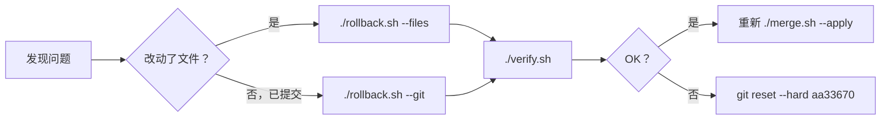

# 07 · 风险清单与回滚方案

> 本文汇总本轮合并的**全部已知风险**、**每个风险的可观测症状**、
> 以及**逐级回滚方案**。任何异常先读 §8，不要手改文件。

---

## 1 · 风险总览

| # | 风险 | 概率 | 影响 | 缓解 |
|---|---|---|---|---|
| R1 | `sections/` 与 `bib` 未配对 → 27 处 `[?]` | 低 | 高 | `verify.sh` 断言 PDF 内 `[?]`=0 |
| R2 | 误删 `11_conclusion.tex` | 低 | 中 | `merge.sh` 只覆盖同名、从不删除 |
| R3 | 根目录 802 处 `\revadd`/`\revdel` 标记丢失 | **必现** | 中 | 接受；用 latexdiff 重做标记稿 |
| R4 | 回信写 222 条、稿件实为 199 条 | **必现** | **高** | 见 §4，推送前必须处理 |
| R5 | Figure 2 根节点换行冲突 | **必现** | 低 | 见 `08_冲突裁决_Figure2根节点.md` |
| R6 | `main_clean/` 图与根目录脱节 | **已发生** | 低 | 本轮合并顺带修复 |
| R7 | 追踪的 LaTeX 中间产物污染 diff | 中 | 低 | 本轮不动，后续单独提交 |
| R8 | Table 1 `# refs` 语义争议 | 低 | 中 | 已裁决，见 §3 |
| R9 | 远端又有新提交导致 push 被拒 | 中 | 低 | `git fetch` + `rebase` |
| R10 | `latexdiff` 未安装 | **已发生** | 中 | `brew install latexdiff` |

---

## 2 · R1：`sections/` 与 `bib` 必须成对替换

### 为什么危险

```
若只换 bib、不换 sections  → 27 个 key 变 [?]
若只换 sections、不换 bib  →  3 个 key 变 [?]
```

**实测数据**：

```
repo(root, 已 strip) 引用的 key 数 : 222
WS 引用的 key 数                    : 199

仅仓库正文引用、WS bib 没有的 key : 27
GIFT-Eval, Time-LLM, aksu2024gifteval, bamford2023, box1970, cai2025,
chen2023b, du2024, gao2024, gholamrezaei2023conditioning, lozano2023dual,
miao2025, nater2025, oppel2025, qian2024, qin2025, qiu2024tfb, shan2021,
shankar2025, tao2024, wang2021bigru, wang2024c, wi2023, zhang2023imputation,
zhang2024spatial, zhang2025a, zhou2024cross

两侧都引用的 key                     : 195
仅 WS 正文引用的 key                 : 4
```

### 症状

- PDF 里出现 `[?]` 或 `(?)`
- `.log` 里 `Citation 'xxx' undefined`
- `is26.bbl` 的 `\bibitem` 数 ≠ 199

### 缓解

`merge.sh` 把 bib 两处的拷贝放在**同一段原子操作**里，
中间不做其他事；`verify.sh` 同时抽 PDF 文本数 `[?]`。

### 若已发生

```bash
./rollback.sh --files
./merge.sh --apply
./verify.sh
```

---

## 3 · R8：Table 1 `# refs` —— 已裁决为 **199 正确**

### 证据

| 证据 | 内容 |
|---|---|
| 表 1 标题原文 | "**\# refs** is the count of **references cited** in each survey" |
| 同列兄弟行 | `318`（Nie et al.）、`115`（Arsenault et al.）—— **都是引用数** |
| 工作区实际 | `is26.bbl` = **199** ✅ |
| 工作区 Window 列 | `1950--2026`，与 bib 最小年份 1950 一致 ✅ |
| 上游旧值 `131` | 实为**语料规模**，语义上不匹配本列 ❌ |

工作区额外加了一句 captions 说明 pre-2021 窗口。

### 结论

**无需进一步动作。** 若审稿人后来要求改回，改 `14_tables.tex` 一行即可。

---

## 4 · R4：回信数字 222 vs 稿件 199（推送前必处理）

### 事实

`d90bd4d` 提交时的 `.bbl` 确实有 **222** 条 bibitem
（当时 bib 303 条、正文引用 222 条）。
本轮去重后正文引用降到 **199**，回信**没同步**。

### 污染范围

```bash
cd "$REPO"
grep -rn '222' --include="*.md" .
```

| 文件 | 出现 |
|---|---|
| `response_to_reviewers_final.md` | 4× `131`、2× `222` |
| `response_to_technical_check_final.md` | 1× `222` |
| `修改内容清单_20260913.md` | 12×`131` 9×`222` 6×`130` 2×`303` 2×`129` 1×`228` 1×`207` 1×`199` |

### ⚠️ 不要全局替换

`222` 可能出现在无关语境（页码、日期、其他统计量）。
逐处确认：

```bash
grep -rn '222' --include="*.md" "$REPO" -C2
```

### 建议

在推送前（或紧随其后的提交里）把指代参考文献总数的 `222` 改为 `199`，
并复核 `130`/`131` 是否都已统一为 **131**（Methods 现为 `54 + 29 + 48 = 131`）。

---

## 5 · R3：802 处手工标记的取舍

### 事实

| 位置 | 标记 |
|---|---|
| `SurveyOfFTSG/sections/` | `\revadd`/`\revdel` 家族 **802** 处 |
| 宏定义所在 | 根目录 `is26.tex`（15 行 `\providecommand`） |
| 工作区 `is26.tex` | **无**这些定义 |
| 工作区 `sections/` | 无标记（干净） |

### 为什么无法机械继承

本轮改动包含**删除整段**与**改写技术论断**。要在保留旧标记的前提下叠加新标记，
需要人工在 802 处标记里精确定位并叠加 —— 这是**人工工作量**，不是脚本能做的。

### 取舍

✅ **接受**：根目录 `is26_marked.pdf`（59 页手工标记稿）本轮**失去标记**，
但根目录 `is26.pdf` 仍以 `\providecommand` 的默认展开（全部接受）正常编译。

✅ **补偿**：`redline.sh` 用 `latexdiff` 从 git 历史重新生成**更可靠**的标记稿
（字符级 diff，不会漏改）。

### 若必须保留旧标记稿

见 `05_Redline生成指南.md` §7「替代方案」—— 改为**只同步 `main_clean/`**。

---

## 6 · R5 / R6：Figure 2

### R5：根节点换行冲突

仓库 `e7fa6b0` 与工作区对同一个溢出问题给了**不同改法**。
两者都能编译、都无溢出、页面尺寸都是 `623.62 × 467.72 pt`。

**需要你选 A / B / C** —— 详见 `08_冲突裁决_Figure2根节点.md`。

> 真正的关键：`e7fa6b0` **只改了根节点那一行**，
> 而工作区文件另有 **6 行**语义修订（新增 `Controllable & Multimodal` 分支、
> 替换 `WaveGAN`→`Wavelet-based GAN`、修改扩散模型清单等）。
> **绝不能整个丢弃工作区文件**（方案 C）。

### R6：`main_clean/` 的 Figure2 已经脱节

| 位置 | 大小 | md5 前 8 位 |
|---|---:|---|
| 根目录 | 125,047 B | `b409beea` |
| **`main_clean/`** | 125,037 B | `695d3ec3` |
| 工作区 | 126,429 B | `06e5eabe` |

`main_clean/separate_figures/Figure2.pdf` 最后更新于 `aa33670`，
**没有**跟上 `e7fa6b0`。本轮合并会把三处统一。

---

## 7 · R7 / R9 / R10

### R7 编译产物

仓库追踪了 `*.aux *.bbl *.blg *.log *.out *.fdb_latexmk *.fls`。
本轮**不动**（保持改动面最小）。后续清理见 `06_提交与推送指南.md` §7。

> ⚠️ 清理时**不要**删 `*.bbl` —— 部分投稿系统只收 `.bbl` 不跑 `bibtex`。

### R9 push 被拒

```bash
cd "$REPO"
git fetch origin
git --no-pager log --oneline HEAD..origin/main
git rebase origin/main
./verify.sh
git push origin main
```

### R7 后续 —— ✅ 已处理（2026-09-13）

`commit.sh` 首轮提交误纳入 11 个构建中间产物
（`SurveyOfFTSG-main_clean/is26.aux`、`is26.blg`、`is26.log`、`is26.out`、
`is26_redline.*`、`redline_build.log`、`verify_build.log`、根 `verify_build.log`），
已 `git rm --cached` 并新增 `.gitignore`：

```
*.aux
*.blg
*.log
*.out
*.synctex.gz
*.fdb_latexmk
*.fls
```

⚠️ 同时误删了已跟踪的 `is26.fdb_latexmk` / `is26.fls`，已用
`git checkout --` 还原。**教训：`rm -f *.{aux,fdb_latexmk,fls,...}` 这类清理
命令会连带删掉仓库已跟踪的文件**，执行前务必 `git status` 复核。

### R10 latexdiff

```bash
export PATH="/opt/homebrew/bin:$PATH"
brew install latexdiff
```

> ⚠️ 首次运行 `brew` 可能触发 `brew vendor-install ruby`（一次性引导，**较慢**）。
> 若报 `Another 'brew vendor-install ruby' process is already running`，
> 说明它正在跑，**等它结束即可**，不要开第二个终端重试。

---

## 8 · 回滚方案

### 8.1 三级回滚



### 8.2 文件级回滚（保留提交历史）

```bash
cd "$WS/merge_docs/scripts"
./rollback.sh --list     # 列出所有 .merge_backup_* 回滚点
./rollback.sh --files    # 从最近的回滚点还原
./verify.sh              # 确认还原后的构建状态
```

备份目录结构：
```
.merge_backup_20260913_210500/
├── root/sections/*.tex          (14 个旧文件)
├── clean/sections/*.tex         (11 个旧文件)
├── root/ultimate_complete.bib   (303 条)
├── clean/ultimate_complete.bib  (303 条)
└── figs/                        (旧 Figure1/2.pdf)
```

### 8.3 git 级回滚 ⚠️

```bash
./rollback.sh --git          # 交互式确认后 git reset --hard <目标>
```

该操作**丢弃提交**。`rollback.sh` 会先打印 `git log` 和
`git stash list`，二次确认后才执行。

手动版：

```bash
cd "$REPO"
git --no-pager log --oneline -5      # 先看清在哪
git reset --hard aa33670
git clean -fd                        # ⚠️ 会删未跟踪文件
git --no-pager log --oneline -3
git status -sb
```

> ⚠️ `git clean -fd` 会删除**未跟踪**文件。若 `merge_docs/` 之类还没提交，
> 先确认它不在 `$REPO` 内（实际在 `$WS` 内，是安全的）。

### 8.4 已推送后的回滚 —— 用 revert 而非 reset

```bash
cd "$REPO"
git revert --no-edit <坏提交>
./verify.sh
git push origin main
```

> ⚠️ 已推送的提交**绝不要** `reset --hard` + `push --force` ——
> 会改写公共历史。

### 8.5 全量手动还原（最终手段）

```bash
cd "$REPO"
git reset --hard aa33670
git clean -fd
./verify.sh
```

---

## 9 · 逐症状排查表

| 症状 | 最可能原因 | 处置 |
|---|---|---|
| PDF 里有 `[?]` | R1：sections/bib 未配对 | `rollback.sh --files` → 重跑 `--apply` |
| `bibitem count` ≠ 199 | R1 | 同上 |
| `11_conclusion.tex` 不见了 | 误删 | 从 `.merge_backup_*/root/sections/` 还原 |
| 根目录编译过不了、`main_clean` 能过 | 根目录 `is26.tex` 的 `\providecommand` 被覆盖 | 从 git 还原根目录 `is26.tex` |
| `forest.sty` 找不到 | `TEXMFHOME` 缺 `inlinedef.sty` | `kpsewhich inlinedef.sty`；应在 `~/Library/texmf` |
| `latexmk: command not found` | 正常 | 不要用 `latexmk`，用 `pdflatex` 链 |
| `pdflatex: command not found` | PATH 未设 | `export PATH="/Library/TeX/texbin:$PATH"` |
| bibtex 报 `I couldn't open file name` | `.aux` 未生成 | 先跑一次 `pdflatex` 再 `bibtex` |
| 标记稿 overfull 很多 | R3：latexdiff 固有 | **正常**，不要消除 |
| `merge.sh` 报「工作树不干净」 | 仓库有未提交改动 | `git stash` 或先提交 |
| `brew install` 卡住无输出 | 正在装 vendored ruby | 等（可能数分钟），别开第二个终端 |
| push 被拒 `fetch first` | R9 | `git fetch` + `rebase` |

---

## 10 · 不可回滚的事项（须提前知情）

| 事项 | 说明 |
|---|---|
| **根目录 802 处手工标记** | 覆盖后**无法**从 git 之外恢复 → 靠 `git reset --hard` 回滚 |
| **旧 `is26_marked.pdf`** | 同上，回滚后才回来 |
| **回信数字 222** | 需人工判断改哪些，无自动化 |
| **Figure 2 的选择** | 两种改法都合法，选了就是选了 |

> ✅ **好消息**：`sections/` 与 `ultimate_complete.bib` 的**旧版本都在 git 里**
> （`aa33670`、`e7fa6b0`），随时可 `git show <sha>:path` 取回。
> 加上 `.merge_backup_*` 的本地副本，**双保险**。

---

## 11 · 风险处置速查

```bash
export PATH="/Library/TeX/texbin:/opt/homebrew/bin:$PATH"
cd "/Volumes/FunkDisk/Study/PHD/论文发表/论文一：金融数据合成综述/SurveyOfFTSG-main0913/merge_docs/scripts"

./rollback.sh --list              # 看回滚点
./rollback.sh --files             # 文件级回滚
./rollback.sh --all               # 文件级 + git 级（会二次确认）

# 手动查回信数字问题（R4）
grep -rn '222' --include="*.md" "/Volumes/FunkDisk/Study/PHD/论文发表/论文一：金融数据合成综述/SurveyOfFTSG" -C2

# Figure 2 冲突（R5）
diff -u "/Volumes/FunkDisk/Study/PHD/论文发表/论文一：金融数据合成综述/SurveyOfFTSG/standalone_fig2.tex" \
        "/Volumes/FunkDisk/Study/PHD/论文发表/论文一：金融数据合成综述/SurveyOfFTSG-main0913/standalone_fig2.tex"
```
